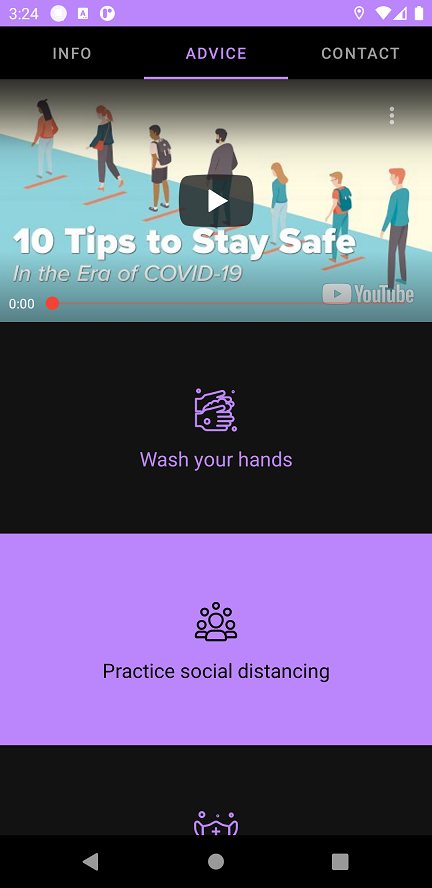
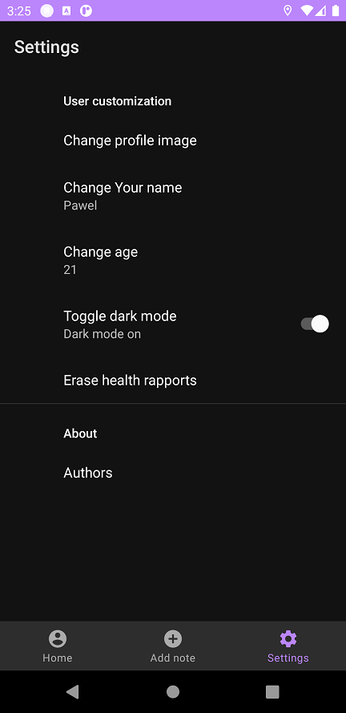

# CovidBook
Repository for Covid application

# Introduction
Java based app for android devices that may help with health self control during covid-19 pandemy.

## Libraries
Project is created with:
* androidyoutubeplayer
* play-services-maps
* graphview
* gson

## Screenshots
               
              
